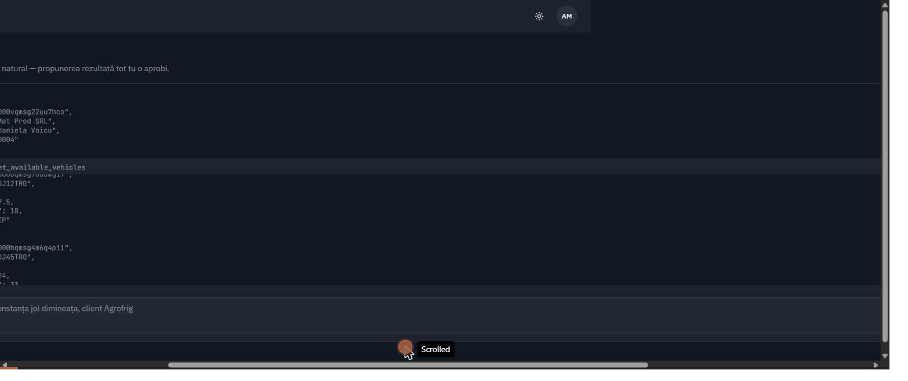
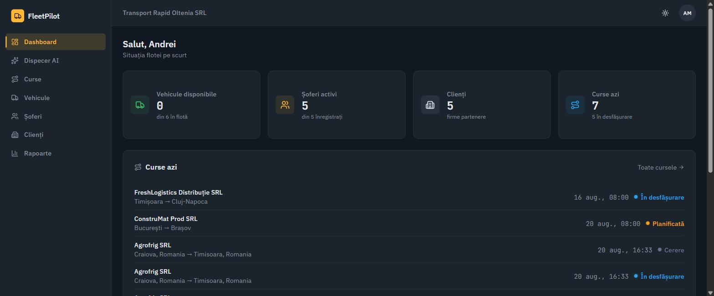
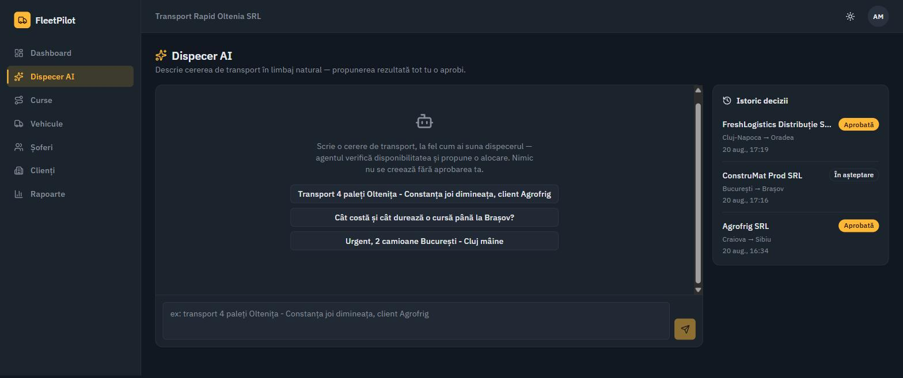
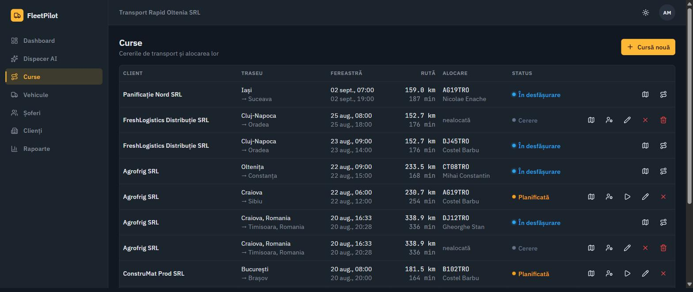
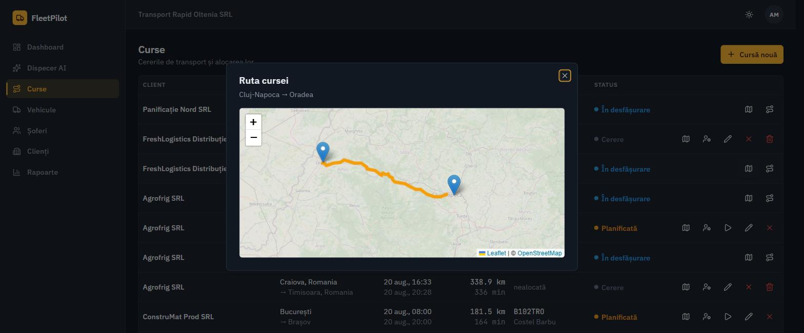
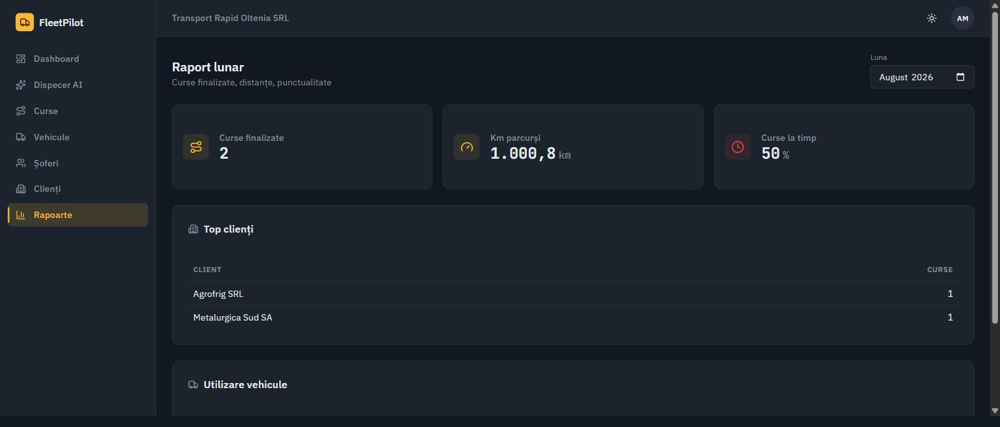

# FleetPilot

Platformă de management de flotă cu **dispecer AI** pentru firme mici de transport marfă din România (2–20 camioane).

Firmele mici de transport lucrează haotic: comenzile vin pe telefon sau WhatsApp, dispecerul alocă manual șoferii dintr-un caiet sau Excel, iar clienții sună să întrebe „unde e marfa mea". FleetPilot digitizează evidența flotei și a curselor, arată poziția vehiculelor pe hartă în timp real, și pune la dispoziția dispecerului un agent AI care **propune** alocări din cereri scrise în limbaj natural — dar nu creează sau modifică nimic fără aprobare umană explicită.



## De ce e diferit

Majoritatea platformelor mici de transport din România sunt contabilitate-heavy și non-AI (Soft-Transport, QuickCargo, DKV CargoApps); telematica enterprise (Samsara, Motive, Fleetio) e supra-dimensionată pentru 2–20 camioane; bursele de marfă (Timocom, Trans.eu) rezolvă altă problemă (matching extern între firme).

Dispecerul AI din FleetPilot e construit pe un principiu strict: **agentul propune, omul aprobă**. Fiecare propunere trece printr-un card explicit cu Aprobă / Modifică / Respinge, iar orice decizie e logată în `AgentAction` (audit trail). Nimic nu ajunge în baza de date fără un click al dispecerului.

## Ce face

- **Evidență flotă**: vehicule (capacitate, status, expirări ITP/RCA/rovinietă), șoferi (permise, absențe), clienți.
- **Curse**: creare/alocare/pornire/finalizare cu mașină de stări completă (`REQUEST → PLANNED → IN_PROGRESS → COMPLETED`), rută + distanță/durată reale via OSRM.
- **Hartă live**: poziție GPS simulată pe traseul real al cursei (interpolare pe geometria OSRM, viteză variabilă, pauze de șofer), cu mod accelerat pentru demo-uri (o cursă de câteva ore, în câteva minute).
- **Dispecer AI**: scrii „transport 4 paleți Oltenița - Constanța joi dimineața, client Agrofrig" — agentul verifică vehicule/șoferi disponibili, calculează ruta, detectează conflicte de orar, și propune o alocare cu justificare. Fiecare pas (tool apelat + rezultat) e vizibil în chat, colapsabil — nu e o cutie neagră.
- **Notificări**: cursă întârziată sau finalizată, alertă zilnică pe documente de vehicul expirate/pe cale să expire — toate prin Socket.io, izolate per firmă.
- **Raport lunar**: curse finalizate, km parcurși, procent la timp, top clienți, utilizare vehicule.

## Cum funcționează dispecerul AI

1. Dispecerul scrie liber, în română: „transport 4 paleți Oltenița → Constanța, joi dimineața, client Agrofrig".
2. Modelul (Claude, buclă de tool use scrisă manual în `agent/loop.ts`, nu SDK black-box) decide singur ce tool-uri apelează și în ce ordine — nu e un flow hardcodat:
   - `get_client_by_name` — găsește clientul (căutare diacritic-insensitivă)
   - `get_available_vehicles` / `get_available_drivers` — filtrează pe capacitate, fereastra cerută și absențe
   - `calculate_route` — distanță/durată reale via OSRM
   - `check_schedule_conflicts` — verifică suprapuneri cu alte curse
   - `create_trip_draft` — **nu scrie nimic în bază de date**, doar validează și întoarce un draft
3. Fiecare apel de tool și rezultatul lui rămân vizibile în chat, într-un panou colapsabil „Pași agent" — dispecerul poate verifica raționamentul, nu doar concluzia.
4. Dacă draftul e valid, apare un card de propunere cu justificare scurtă și trei acțiuni: **Aprobă** / **Modifică** (formular inline) / **Respinge**. Nimic nu se creează fără unul din aceste click-uri.
5. La aprobare, cursa trece prin **exact aceleași servicii** folosite de restul aplicației (`trip.service.createTrip`/`assignTrip`) — draftul agentului e doar o pre-verificare informativă; verificarea reală (capacitate, conflicte de orar, absențe) rulează din nou, într-o tranzacție Serializable, chiar la momentul aprobării.
6. Fiecare decizie — aprobat, modificat sau respins — se loghează în `AgentAction`: ce a propus agentul, ce a decis dispecerul, când.
7. Cazuri de margine tratate explicit: date incomplete → agentul întreabă, nu ghicește; niciun vehicul disponibil → propune altă dată; fereastră de timp clar în trecut → tool-ul o respinge și cere confirmare, ca să nu treacă neobservată într-un draft altfel valid.

## Cum funcționează harta live

- La pornirea unei curse, traseul e geometria reală întoarsă de OSRM (nu linie dreaptă între origine și destinație).
- La fiecare 5 secunde reale, poziția vehiculului avansează pe acest traseu — interpolare haversine + calcul de bearing pentru direcție — cu viteză variabilă și pauze aleatorii de șofer. Modul „accelerat" comprimă o cursă de ore în câteva minute, pentru demo-uri.
- Poziția se emite prin Socket.io într-o cameră izolată per firmă (`company:{companyId}`) și se scrie în `VehiclePosition` pentru istoric.
- La restart de server, simulările curselor `IN_PROGRESS` se reiau automat din starea reală a cursei — nicio cursă nu rămâne „orfană" doar pentru că serverul a repornit.

## Stack tehnic

| Zonă         | Tehnologie                                                                 |
| ------------ | -------------------------------------------------------------------------- |
| Frontend     | React 18 + Vite, TypeScript, Tailwind CSS, shadcn/ui, TanStack Query       |
| Backend      | Node.js + Express, TypeScript                                              |
| Bază de date | PostgreSQL + Prisma ORM                                                    |
| Hărți        | Leaflet + OpenStreetMap, rute via OSRM public API                          |
| Real-time    | Socket.io (poziții GPS, notificări — camere per firmă)                     |
| AI           | Claude API (`claude-sonnet-4-6`) cu tool use, buclă de agent scrisă manual |
| Auth         | JWT + refresh tokens, bcrypt, roluri (ADMIN / DISPATCHER / DRIVER)         |
| Validare     | Zod, partajat între client și server (`shared/`)                           |
| Deploy       | Docker Compose, Caddy (HTTPS automat + reverse proxy)                      |

## Arhitectură

Monorepo cu trei workspace-uri: `client/`, `server/`, `shared/` (tipuri și scheme Zod comune).

Backend-ul e strict stratificat — `routes → controllers → services → prisma`, logica de business trăiește doar în services. Agentul AI e izolat în `server/src/agent/`: tool-urile (`get_available_vehicles`, `get_available_drivers`, `get_client_by_name`, `calculate_route`, `check_schedule_conflicts`, `create_trip_draft`) sunt definite declarativ — un tool nou se adaugă fără să atingi bucla agentului.

```
client/    React + Vite, pagini pe /app (Dashboard, Curse, Vehicule, Șoferi, Clienți, Dispecer AI, Rapoarte)
server/    Express API, agent/, realtime/ (Socket.io), services/ (curse, GPS, alerte, rapoarte)
shared/    scheme Zod + tipuri TS, sursă unică pt. validare pe ambele capete
```

## Dovezi verificate

Nu doar afirmații — cifre din testare reală, e2e:

- Rută **Craiova → Timișoara**: 338.9 km, 336 min, calculate live prin OSRM (nu hardcodat).
- Simulator GPS: cursă cu durată reală 43 min → **43 secunde** în mod accelerat, poziții emise corect la fiecare 5s reale, verificate prin socket.
- Rate limiting: **429 confirmat la a 11-a încercare** de login greșit (limită 10/15min).
- Agent AI: **39/39 + 81/82 scenarii** de test (inclusiv adversariale — injecție de prompt, spoofing de companyId) trecute, izolare multi-tenant confirmată imună la manipulare din text.

## Screenshot-uri

| Dashboard                                    | Dispecer AI                                     |
| -------------------------------------------- | ----------------------------------------------- |
|  |  |

| Curse                                | Hartă live                                   |
| ------------------------------------ | -------------------------------------------- |
|  |  |

| Raport lunar                                  |
| --------------------------------------------- |
|  |

## Rulare locală

```bash
npm install
cp server/.env.example server/.env   # completează DATABASE_URL + ANTHROPIC_API_KEY
npm run --workspace server prisma:migrate
npm run --workspace server prisma:seed
npm run dev
```

Cont demo după seed: `admin@transportrapid.ro` / `Parola123!`.

## Rulare cu Docker (producție)

```bash
cp .env.example .env   # DOMAIN, parole, ANTHROPIC_API_KEY
docker compose -f docker-compose.prod.yml up -d --build
docker compose -f docker-compose.prod.yml exec server npx prisma db seed
```

Caddy expune clientul pe `:80`/`:443` și obține automat HTTPS din `DOMAIN`; `/api` și `/socket.io` sunt proxiate spre server.

## Out of scope (v1, intenționat)

Facturare, plăți, aplicație mobilă nativă, chat între utilizatori, multi-limbă, integrare GPS hardware reală. Decizii conștiente de scop, nu lipsuri — platforma țintește dispeceratul unei singure firme mici, nu o suită enterprise completă.
